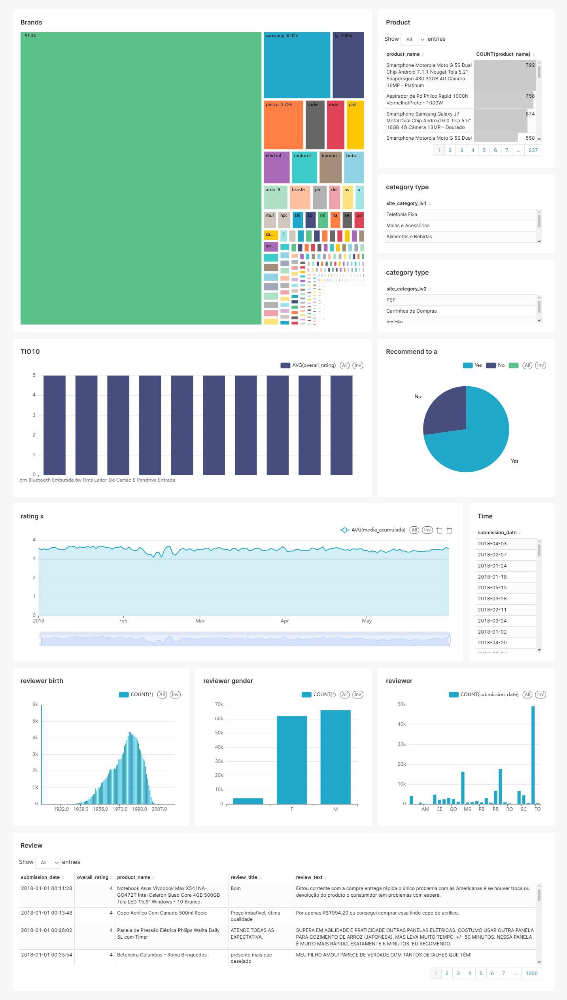

# 📊 Projeto: Dashboard com Apache Superset - Análise de Reviews B2W

Este projeto utiliza Apache Superset para visualizar e analisar dados de avaliações de produtos da base pública [B2W Reviews 01](https://github.com/americanas-tech/b2w-reviews01).

## ⚙️ Tecnologias
- Apache Superset
- SQL
- Docker

## 🛠️ Base do Projeto

Este projeto foi iniciado a partir do tutorial oficial **[Apache Superset - Get Started](https://superset.apache.org/docs/installation/installing-superset-using-docker-compose/)**.

A estrutura de containers Docker foi utilizada para levantar o ambiente de visualização de dados, e a aplicação foi customizada com a base de dados pública [B2W Reviews 01](https://github.com/americanas-tech/b2w-reviews01).

## 📈 O que foi feito
- Configuração do ambiente com Docker Compose 
- Criação de dashboards com gráficos interativos.
- Cálculo da **média acumulada** das notas ao longo do tempo usando SQL.
- Análise de tendências de satisfação dos clientes.

## 📊 Exemplo de cálculo SQL
```sql
SELECT
  submission_date,
  product_name,
  AVG(overall_rating) OVER (
    PARTITION BY product_name
    ORDER BY submission_date
    ROWS BETWEEN UNBOUNDED PRECEDING AND CURRENT ROW
  ) AS media_acumulada
FROM "B2W-Reviews01-teste3";
```


## 📊 Dashboard Superset - Reviews B2W


